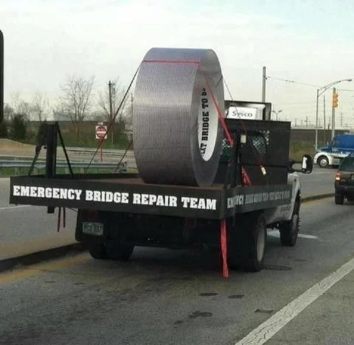

# Duct Tape Challenge!



> ⚠️ **This repository is for demo purposes only**

## Requirements

To run this project, **put** `.env` file, which is shared in our MM channel, on your project's root. 

## Installation
### Running the Node.js Server

~~If preferred, you can run a Node.js server instead.~~ In fact, it works only on a Node.js, don't try PHP.
To do this, navigate to the root of the project, install the dependencies (only the first time) and run the start script:

```
$ cd adyen-components-js-sample-code
$ npm i
$ npm start
```

A Node.js server will start on `http://localhost:${PORT}`.

## License

This repository is open source and available under the MIT license. For more information, see the LICENSE file.
